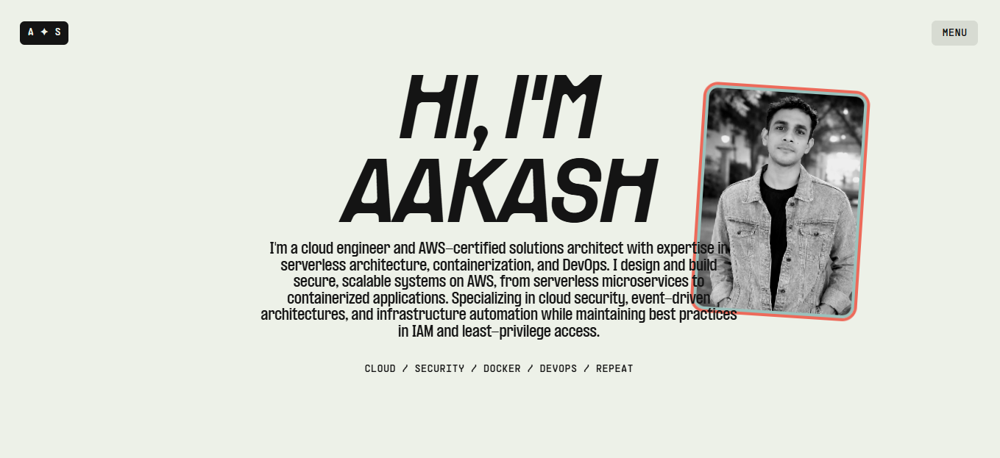
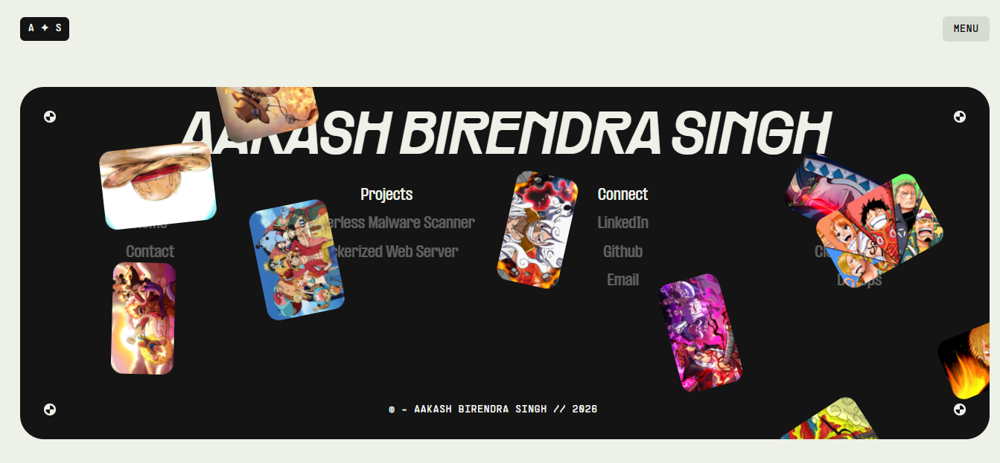

# Aakash Birendra Singh - Portfolio

A modern, professional portfolio website showcasing expertise in AWS, Cloud Computing, DevOps, and Cloud Security. Built with cutting-edge web technologies for optimal performance and user experience.

**[🔗 Live Demo](https://aakashportfolio222.vercel.app/)**


---

## 🎯 Overview

This portfolio is a fully responsive, interactive web application designed to showcase professional projects, services, and expertise in cloud technologies and DevOps. Built with modern web standards and interactive animations, it creates an engaging experience for potential clients and employers.

### Key Features

- **Responsive Design** - Seamlessly adapts to all device sizes
- **Interactive Animations** - Smooth scrolling and engaging transitions powered by GSAP and Lenis
- **Modern UI/UX** - Clean, professional design with intuitive navigation
- **Performance Optimized** - Built with Vite for lightning-fast load times
- **Service Showcase** - Highlight key offerings and expertise areas
- **Contact Integration** - Easy-to-use contact section with email and social links
- **Smooth Scrolling** - Custom scroll experience with Lenis scroll library

---

## 🛠️ Tech Stack

- **Frontend Framework**: Vanilla JavaScript (ES6+)
- **Build Tool**: [Vite](https://vitejs.dev/)
- **Animation Library**: [GSAP](https://greensock.com/gsap/)
- **Scroll Library**: [Lenis](https://github.com/darkroom-engineering/lenis)
- **Styling**: Custom CSS with responsive design
- **Fonts**: Custom web fonts (Rader, Formula, Supply Mono)

---

## 📦 Installation & Setup

### Prerequisites

Ensure you have **Node.js** (v14.0.0 or higher) and **npm** installed on your system.

### Step 1: Install Dependencies

```bash
npm install
```

This will install all required packages including GSAP, Lenis, and Vite.

### Step 2: Start Development Server

```bash
npm run dev
```

The development server will start, and you can access your portfolio at `http://localhost:5173` (or the URL shown in your terminal).

### Build for Production

To create an optimized production build:

```bash
npm run build
```

### Preview Production Build

To preview the production build locally:

```bash
npm run preview
```

---

## 📁 Project Structure

```
portfolio/
├── css/
│   ├── about.css           # About section styles
│   ├── contact.css         # Contact page styles
│   ├── fonts.css           # Font definitions
│   ├── footer.css          # Footer styles
│   ├── globals.css         # Global styles and variables
│   ├── home.css            # Home page styles
│   ├── menu.css            # Navigation menu styles
│   ├── transition.css      # Page transition animations
│   └── work.css            # Work/projects section styles
├── js/
│   ├── about.js            # About section functionality
│   ├── featured-work.js    # Featured projects logic
│   ├── footer.js           # Footer interactions
│   ├── hero.js             # Hero section animations
│   ├── lenis-scroll.js     # Smooth scroll setup
│   ├── menu.js             # Navigation menu logic
│   ├── services.js         # Services section functionality
│   └── transition.js       # Page transition animations
├── public/
│   ├── fonts/              # Custom font files
│   ├── images/             # Project and content images
│   └── screenshot/         # Portfolio screenshots
├── index.html              # Home page
├── contact.html            # Contact page
├── package.json            # Project dependencies
├── vite.config.js          # Vite configuration
└── vercel.json             # Vercel deployment config
```

---

## ✨ Features

### 1. **Hero Section**
Eye-catching hero section with animated typography and smooth transitions that grab visitor attention.

### 2. **About Section**
Detailed overview of professional background, skills, and expertise in cloud technologies.

### 3. **Services**
Showcase of key service offerings:
- AWS Cloud Services
- Cloud Security
- DevOps Solutions

### 4. **Featured Work**
Gallery of notable projects and accomplishments with detailed descriptions.

### 5. **Contact Section**
Professional contact area with:
- Email: aakashsingh1937@gmail.com
- LinkedIn: [linkedin.com/in/aakash-singh-7b8416318](https://www.linkedin.com/in/aakash-singh-7b8416318)
- GitHub: [github.com/Aakashsingh0388](https://github.com/Aakashsingh0388)

### 6. **Smooth Scrolling**
Lenis integration for a premium scrolling experience across all pages.

### 7. **Page Transitions**
Elegant page transition animations for seamless navigation between sections.

---

## 📸 Screenshots

### Screenshot 1


### Screenshot 2


### Screenshot 


### Screenshot 4


### Screenshot 5


---

## 🚀 Deployment

This project is optimized for deployment on Vercel. The `vercel.json` configuration file ensures proper routing and performance settings.

To deploy on Vercel:

1. Push your repository to GitHub
2. Connect your GitHub repository to Vercel
3. Vercel will automatically detect the Vite configuration and deploy

---

## 📝 Customization

### Update Personal Information
Edit the contact information and social links in:
- `index.html` - Navigation and footer links
- `contact.html` - Contact page details

### Modify Colors & Styling
Update the CSS variables in `css/globals.css`:
```css
:root {
    --bg: #edf1e8;
    --fg: #141414;
    --accent1: #ed6a5a;
    /* ... more colors ... */
}
```

### Add Projects
Edit `index.html` to add new projects in the featured work section.

---

## 📧 Contact

**Aakash Birendra Singh**

- **Email**: [aakashsingh1937@gmail.com](mailto:aakashsingh1937@gmail.com)
- **LinkedIn**: [linkedin.com/in/aakash-singh-7b8416318](https://www.linkedin.com/in/aakash-singh-7b8416318)
- **GitHub**: [github.com/Aakashsingh0388](https://github.com/Aakashsingh0388)

---

## 📄 License

This project is licensed under the **MIT License**.

```
MIT License

Copyright (c) 2026 Aakash Birendra Singh

Permission is hereby granted, free of charge, to any person obtaining a copy
of this software and associated documentation files (the "Software"), to deal
in the Software without restriction, including without limitation the rights
to use, copy, modify, merge, publish, distribute, sublicense, and/or sell
copies of the Software, and to permit persons to whom the Software is
furnished to do so, subject to the following conditions:

The above copyright notice and this permission notice shall be included in all
copies or substantial portions of the Software.

THE SOFTWARE IS PROVIDED "AS IS", WITHOUT WARRANTY OF ANY KIND, EXPRESS OR
IMPLIED, INCLUDING BUT NOT LIMITED TO THE WARRANTIES OF MERCHANTABILITY,
FITNESS FOR A PARTICULAR PURPOSE AND NONINFRINGEMENT. IN NO EVENT SHALL THE
AUTHORS OR COPYRIGHT HOLDERS BE LIABLE FOR ANY CLAIM, DAMAGES OR OTHER
LIABILITY, WHETHER IN AN ACTION OF CONTRACT, TORT OR OTHERWISE, ARISING FROM,
OUT OF OR IN CONNECTION WITH THE SOFTWARE OR THE USE OR OTHER DEALINGS IN THE
SOFTWARE.
```

---

## 🙏 Acknowledgments

- **GSAP** - For powerful animation capabilities
- **Lenis** - For smooth scrolling library
- **Vite** - For fast and modern build tooling
- **Vercel** - For seamless deployment

---

**Built with ❤️ by Aakash Birendra Singh**

Last Updated: February 2026
